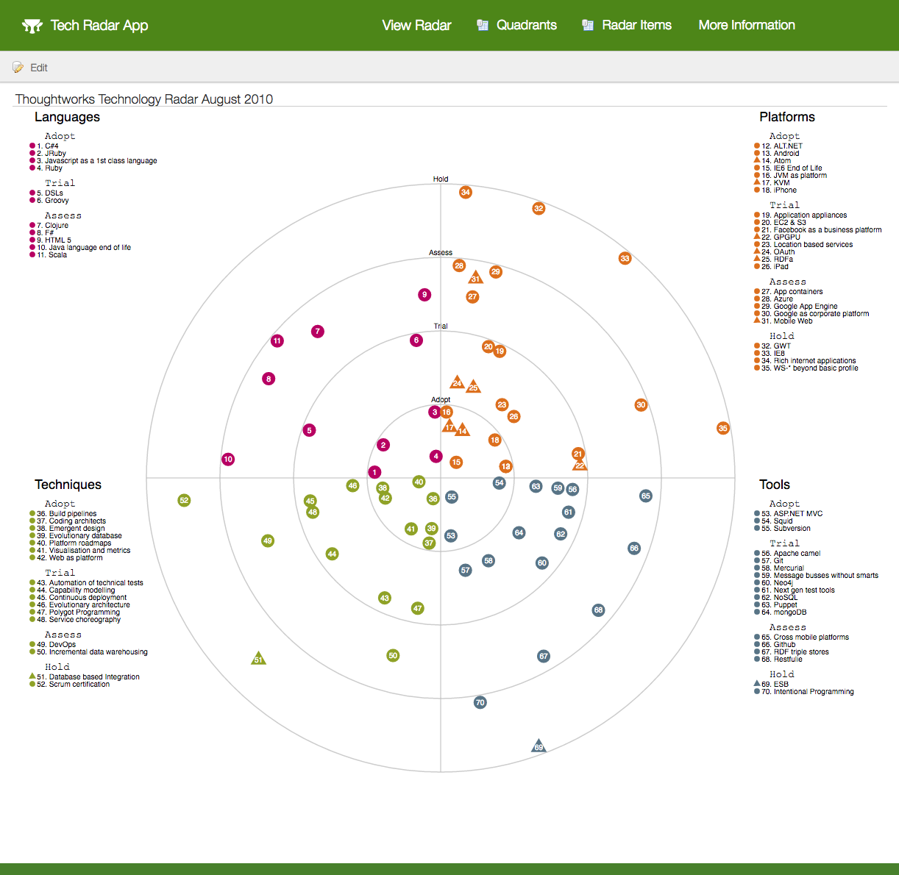

# Grails Backed Implementation of a Thoughtworks Style Technology Radar

This was created as an exercise to become more familiar with the Grails
http://docs.grails.org/latest/guide/introduction.html#webApiAndAngularProfiles[REST API,
AngularJS Profiles] and http://views.grails.org/latest/#_json_views[JSON Views].   Starting
with a fork JavaScript based https://github.com/bdargan/techradar[techradar project]
created by https://github.com/bdargan[bdargan], this project adds a data driven REST service
behind the rendered radar.

The radar data is loaded during application startup from
link:grails-app/init/BootStrap.groovy[BootStrap.groovy].

## Screenshot

## Rough Implementation Steps

. Created a starting application: `grails create-app techradar --profile=angular`

. Created Radar, Quadrant and Item domains: `grails create-domain-resource [name]`

. After filling in their properties, generated all the views and controller implementations:
`grails generate-all "*"`

. Generated all the scaffolding based AngularJS CRUD screens for the domains:
`grails ng-generate-all [name] true`

. Folded in the original project's JavaScript libraries into the Grails project structure (`radar.js`, `utils.js`,
in addition to lodash.underscore and protovis libraries).

. Replaced original project's static `radarData.js` file with JSON View based REST Service:

.. Added `RadarController.showData` for the new data API.

.. To match the structure of the original static data, a custom JSON view was created
`showData.gson` which included customized templates for the Quadrant and Item domains.

.. Added call to new REST API to read data in the customized format and pass to call
to initialize the radar in `radarShowContoller.js`

.. Added `

` to the Radar domain's Angular template `show.tpl.html` for the radar
to be rendered.

[source,groovy]
.grails-app/controllers/techradar/RadarController.groovy
----
    def showData(Radar radar) {
        respond radar, view: 'showData'
    }
----

[source,groovy]
.grails-app/views/radar/showData.gson
----
import techradar.Radar

model {
    Radar radar
}

json g.render(radar, [ excludes: ['quadrants']]) {
    quadrants g.render( template: 'quadrant', collection: radar.quadrants, var: 'quadrant')
}
----
//TODO: once github supports includes: include::grails-app/views/radar/showData.gson[]

[source,groovy]
.grails-app/views/radar/_quadrant.gson
----
import techradar.Quadrant

model {
    Quadrant quadrant
}

json g.render(quadrant, [includes: ['color'], expand: ['items'] ]) {
    'quadrant' quadrant.name
    items g.render( template: 'item', collection: quadrant.items, var: 'item')
}
----
//TODO: once github supports includes: include::grails-app/views/radar/_quadrant.gson[]

[source,groovy]
.grails-app/views/radar/_item.gson
----
import techradar.Item

model {
    Item item
}

json g.render(item, [includes: ['name', 'movement', 'url']]) {
    pc {
        r item.radialCoordinate
        t item.angularCoordinate
    }
}
----
//TODO: once github supports includes: include::grails-app/views/radar/_item.gson[]

[source,javascript]
.grails-app/assets/javascripts/techradar/radar/controllers/radarShowController.js
----
    var h = 1000;
    var w = 1200;
    var radar_data = $resource('/radar_data/:radarId').get({radarId: $stateParams.id});
    radar_data.$promise.then(function(data) {
        init(h, w, data);
    });
----

## References
 * https://grails.org/[Grails Framework]
 * http://views.grails.org[Grails Views]
 * https://grails-plugins.github.io/grails-angular-scaffolding/latest[Angular Scaffolding Plugin]
 * https://www.thoughtworks.com/radar[Thoughtworks Technology Radar]
